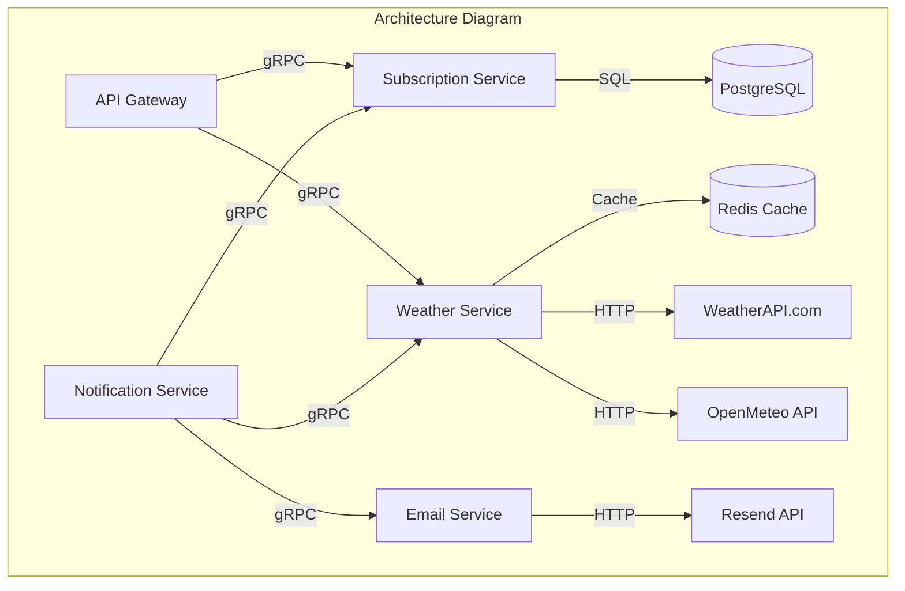

# ADR-006: Transition to Microservice Architecture

**Status:** Proposed  
**Date:** 2025-07-06  
**Author:** Andrii Solomka

## Context

The current Weather API application has a monolithic architecture that combines functionality for subscriptions, weather data retrieval, geocoding, messaging, and task scheduling. To adopt new technologies and enable scalable, resilient, and flexible development, we should migrate from monolith to microservices.

## Considered Options

### Architecture Approach:

1. **Maintain Monolithic Architecture**  
   - **Pros:**  
     - Simpler development and testing  
     - Simplified component communication  
     - Lower DevOps overhead  
   - **Cons:**  
     - Limited scalability of individual components  
     - Low failure isolation  
     - Difficulties with implementing changes

2. **Split into Microservices**  
   - **Pros:**  
     - Independent component scaling  
     - Higher failure isolation  
     - Flexibility in technology choices  
     - Parallel development by teams  
   - **Cons:**  
     - More complex infrastructure  
     - Requires additional orchestration  
     - More challenging integration testing

3. **Hybrid Architecture (Monolithic Core with Separate Services)**  
   - **Pros:**  
     - Gradual transition to microservices  
     - Preserves advantages of monolithic architecture in key components  
   - **Cons:**  
     - More complex architecture  
     - Less clear boundaries between services

### Communication Protocols:

1. **REST API**
   - **Pros:**
     - Widely used, easy to implement
     - Simple to understand and debug
     - Doesn't require additional testing tools
   - **Cons:**
     - Less efficient for frequent inter-service communication
     - Higher network overhead

2. **gRPC**
   - **Pros:**
     - High performance
     - Strong typing through Protocol Buffers
     - Support for bidirectional streaming
     - Efficient use of HTTP/2
   - **Cons:**
     - More complex setup and understanding
     - Requires code generation from .proto files
     - Limited browser support

3. **GraphQL**
   - **Pros:**
     - Flexible querying of required data
     - Reduction of redundant data
     - Single access point for data
   - **Cons:**
     - Increased complexity for simple interactions
     - Less efficient for internal inter-service communication

## Decision

We decided to **split the system into microservices** with clear boundaries of responsibility:

1. **Subscription Service** - managing user subscriptions
2. **Weather Service** - retrieving and caching weather data and geocoding
3. **Notification Service** - formatting and sending messages
4. **Scheduler Service** - coordinating work between services and executing scheduled tasks

For communication between services, we selected **gRPC** for synchronous inter-service communication, providing:
  - High performance for frequent communication between services
  - Type safety through Protocol Buffers
  - Clear contracts between services
  - Possibility of bidirectional streaming (e.g., for streaming weather data)

For external communication with clients, we will use **REST API** through API Gateway.

## Architecture Diagram

## Consequences

### Positive:
- Each service can be scaled independently
- Failure isolation between services
- Possibility to use different technologies for different services
- Clear boundaries of responsibility between system components
- High performance of inter-service communication thanks to gRPC
- Type safety and API version control through Protocol Buffers
- Reduced network traffic compared to REST API

### Negative:
- Additional complexity of infrastructure and deployment
- Need to configure service discovery system
- More complex testing
- Possible issues with data consistency between services
- More complex gRPC setup process compared to REST API
- Steeper learning curve for new developers unfamiliar with gRPC

